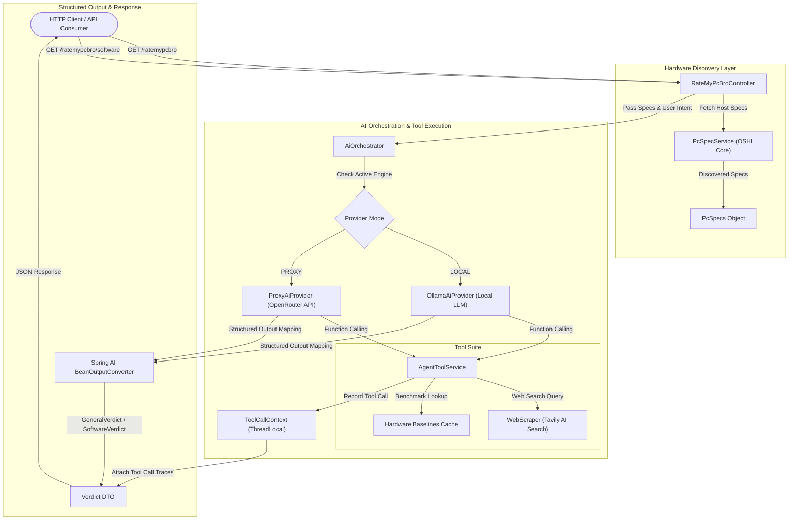

# Rate My PC Bro API

Stateless, AI-powered hardware analysis and performance prediction engine built with Java 21, Spring Boot 3.5, and Spring AI.

## Overview

Rate My PC Bro inspects host system specifications using OSHI (Operating System and Hardware Information) and generates hardware appraisals and software performance verdicts using Large Language Models (LLMs). The service operates statelessly and features agentic tools for live web lookup (via Tavily AI Search) and hardware baseline benchmarks.

---

## Application Architecture Flowchart



---

## Key Architectural Principles

1. **Stateless Operation**: No database dependencies. Hardware specs are captured per request, processed via AI inference, and returned as transient DTOs.
2. **Automated Hardware Discovery**: Uses OSHI to inspect CPU topology, GPU, memory configuration, displays, motherboard, storage, and power sources.
3. **Agentic RAG & Function Calling**: Integrates Spring AI tool calling with Tavily AI web search to retrieve real-time benchmarks and software requirements.
4. **Decoupled Dual Provider**: Runtime toggling between local inference (`LOCAL` via Ollama) and external proxy inference (`PROXY` via OpenRouter API).
5. **Thread-Safe Tool Call Tracing**: Uses `ThreadLocal` context management to track executed tool names, input queries, execution latency, and result snippets attached to each verdict.

---

## Technology Stack

- **Language**: Java 21 (LTS)
- **Framework**: Spring Boot 3.5.13
- **AI Framework**: Spring AI (1.0.0-M5)
- **Hardware Inspection**: OSHI (Operating System and Hardware Information)
- **Web Retrieval**: Tavily AI Search API & Jsoup
- **API Documentation**: SpringDoc OpenAPI (Swagger UI)
- **Build Tool**: Maven

---

## Getting Started

### Prerequisites

- **JDK 21** or higher.
- **Ollama** (required for local AI inference).
- **Llama 3.1 Model**:
  ```bash
  ollama pull llama3.1
  ```

### Running the Application

Execute using the Maven wrapper:

```bash
./mvnw spring-boot:run
```

The application runs on `http://localhost:8081/api`.

### API Documentation (Swagger)

Runtime API documentation is available at:
- `http://localhost:8081/api/swagger-ui/index.html`

---

## API Reference

### Hardware Verdicts

#### 1. General System Verdict
Analyzes system hardware specifications and returns an overall rating, hardware breakdown, recommendations, and tool execution traces.
- **Endpoint**: `GET /ratemypcbro`
- **Response**: `GeneralVerdict` JSON

#### 2. Software Performance Verdict
Predicts performance for a specific application or game on the current hardware configuration.
- **Endpoint**: `GET /ratemypcbro/software`
- **Query Parameters**:
  - `type` (required): Application category (e.g., `game`, `productivity`).
  - `name` (required): Application name (e.g., `Cyberpunk 2077`, `Blender`).
  - `notes` (optional): Additional user context (e.g., `1440p High settings`).
- **Response**: `SoftwareVerdict` JSON

### Configuration & Cache Management

#### 1. Toggle AI Provider
Switches active AI provider at runtime (`LOCAL` or `PROXY`).
- **Endpoint**: `POST /ratemypcbro/config/provider?type={LOCAL|PROXY}`

#### 2. Get Active AI Provider
Retrieves current active AI provider mode.
- **Endpoint**: `GET /ratemypcbro/config/provider`

#### 3. Clear System Caches
Clears in-memory web scraping and hardware baseline lookup caches.
- **Endpoint**: `POST /ratemypcbro/config/cache/clear`
